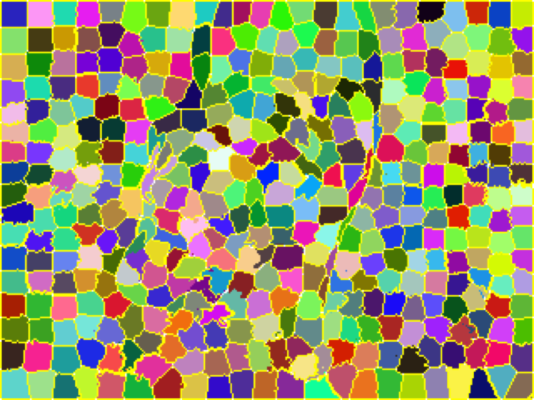
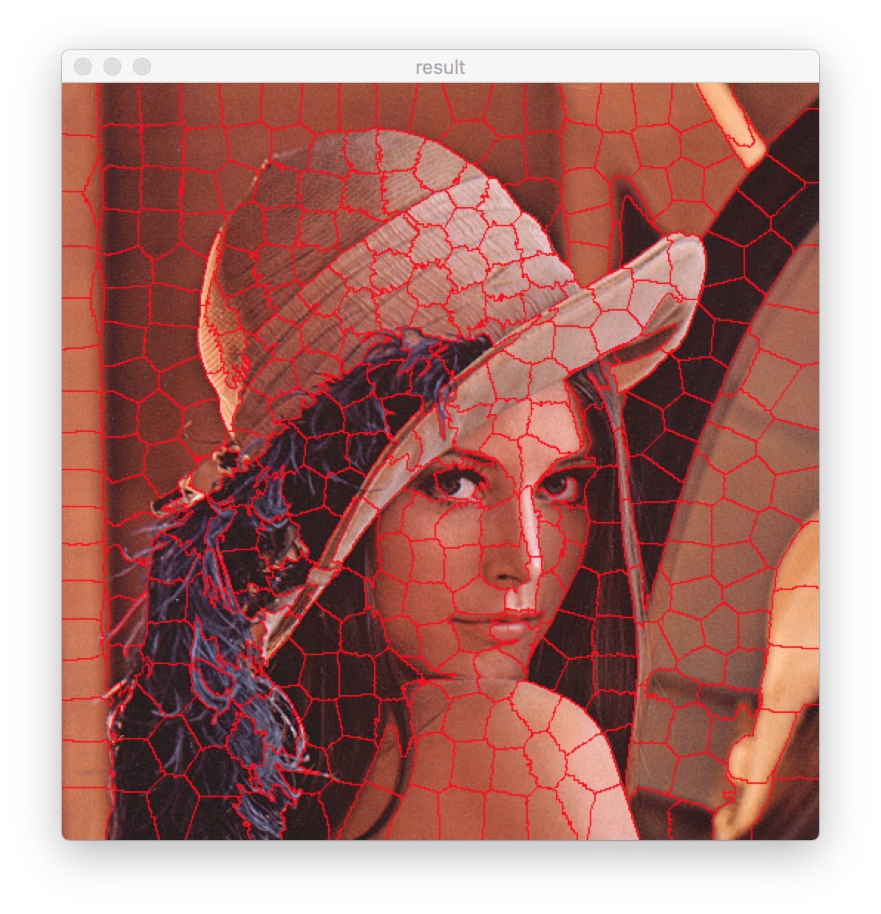

# SLIC Superpixel Implementation
This repository contains an implementation of the SLIC Superpixel algorithm by Achanta et al. (PAMI'12, vol. 34, num. 11, pp. 2274-2282). The C++ implementation is created to work with the strutures of OpenCV.

## Exemplary result
The images below shows an example of an over-segmentation using 400 superpixels and a weight factor of 40.

  
  
  

## Program demo

